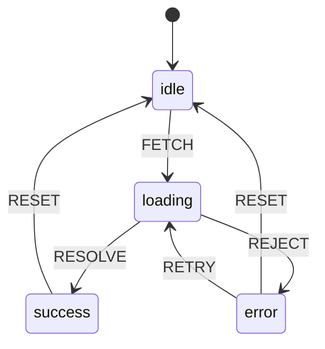

## はじめに

[Valtio](/tomo_local/articles/react-mini-valtio)・[Jotai](/tomo_local/articles/react-mini-jotai) に続く本シリーズ3回目です。今回は今までとは少しアプローチが異なる状態管理のライブラリを自作してみます。

Reactの状態管理において、XStateは「有限状態機械（Finite State Machine）」という概念を採用した独自のポジションを持つライブラリです。ValtioとJotaiが「値が何か」を管理するのに対し、XStateは「**アプリケーションが今どの状態にいるか**」と「**どのイベントでどの状態に遷移するか**」を明示的に定義します。

この記事では、XStateのコアコンセプトを理解するために、その簡易版を自作して、どのようにして状態機械がReactコンポーネントと連携しているのかを探ります。

## 標準のState管理との比較

`useState` を使った状態管理では、複雑なUIフローを表現しようとするとある問題に直面します。

### booleanフラグの増殖問題

データフェッチの状態を `useState` で管理しようとすると、次のようにフラグが増えていきます。

```javascript
const [isIdle, setIsIdle]       = useState(true);
const [isLoading, setIsLoading] = useState(false);
const [isError, setIsError]     = useState(false);
const [isSuccess, setIsSuccess] = useState(false);
```

このアプローチには致命的な問題があります。**ありえない状態が生まれてしまう**ことです。

```javascript
// これらはすべて「ありえない」状態だが、コードは止められない
{ isLoading: true, isSuccess: true }  // ローディング中なのに成功？
{ isError: true, isSuccess: true }    // エラーなのに成功？
{ isLoading: true, isError: true }    // ローディング中なのにエラー？
```

4つのbooleanがあると理論上 2^4 = 16通りの組み合わせが存在しますが、実際に有効なのはそのうちわずか4通りです。

### 有限状態機械による解決

:::message
**有限状態機械（ステートマシン）とは？**
信号機をイメージしてください。信号は「赤」「黄」「青」のどれかひとつだけが光り、「赤と青が同時に光る」ことはありません。このように、**「今の状態は必ずどれかひとつだけ」**というルールで動く仕組みが有限状態機械です。
:::

XStateでは、状態を排他的な「状態名」のひとつとして表現します。

```javascript
// 状態は必ずこの4つのどれかひとつ（信号機の色のように、同時に2つにはならない）
type FetchState = 'idle' | 'loading' | 'success' | 'error';
```

`'idle'` と `'loading'` が同時に成立することはありえません。**型レベルで不正な状態を表現できない**ようにすることが、有限状態機械の最大のメリットです。

## XStateの仕組み（コンセプト）

XStateのポイントは、状態遷移を「マシン定義」として宣言的に記述することです。ここでも信号機のたとえで説明します。

1. **Machine（マシン）**: 信号機の「設計図」にあたります。「赤→黄→青→赤」という遷移ルールが書かれた紙のようなもので、設計図自体は光りません。
2. **Actor（アクター）**: 設計図をもとに作られた「実際の信号機」です。今何色が光っているかを知っていて（`getSnapshot`）、「次へ」と指示を受けて光る色を変え（`send`）、色が変わったら周囲に通知します（`subscribe`）。
3. **useMachine**: この信号機をReactコンポーネントに接続する配線です。光る色が変わるたびに画面を再描画します。

つまり、`createMachine` はただの「設計図」であり、実際の状態値はActorが管理します。

## 簡易版XStateの実装

それでは、TypeScriptを使って `mini-xstate` を実装してみましょう。

:::message
**今回の簡易版の制約**
- **Guards（ガード）**: `cond` による条件付き遷移は実装しません。
- **Actions**: 遷移時のサイドエフェクトは実装しません。
- **Context**: 状態に付随する拡張データは実装しません。
- **Invoke（非同期サービス）**: PromiseやObservableの呼び出しは実装しません。
- **Hierarchical States**: 入れ子の状態は実装しません。
:::

### Step 1: `createMachine` — 設計図を作る

最初に作るのは、信号機の「設計図」にあたる `createMachine` 関数です。「どんな色（状態）があるか」「どのボタン（イベント）を押したらどの色に変わるか」を定義するだけで、設計図自体は光りません。

> 📎 本家XStateの実装: [createMachine - packages/core/src/createMachine.ts](https://github.com/statelyai/xstate/blob/main/packages/core/src/createMachine.ts)

```typescript
type StateConfig<E extends string> = {
  // on: イベント名をキー、遷移先の状態名を値とするオブジェクト（全イベントは省略可能）
  on?: Partial<Record<E, string>>;
};

export type MachineConfig<S extends string, E extends string> = {
  initial: S;
  states: Record<S, StateConfig<E>>;
};

export function createMachine<S extends string, E extends string>(
  config: MachineConfig<S, E>
): MachineConfig<S, E> {
  return config;
}
```

`createMachine` の本体はこれだけです。受け取った設計図（設定）をそのまま返すだけで、**今どの色が光っているかは管理しません**。あくまで「ルールブック」です。

ではなぜオブジェクトをそのまま渡さず関数にするのでしょうか。理由はTypeScriptのジェネリクス推論です。`createMachine({ ... })` と関数を通すことで、`S`（状態名の型）と `E`（イベント名の型）がオブジェクトの中身から自動的に推論されます。直接オブジェクトリテラルを変数に代入すると型が `string` に広がってしまうため、タイプセーフなマシン定義のために関数を経由しています。

### Step 2: `createActor` — 実際の信号機を作る

次に、設計図をもとに「実際に光る信号機」を作る `createActor` を実装します。この信号機は3つの操作ができます。

- **`getSnapshot`**: 今何色が光っているか確認する
- **`send`**: ボタンを押して色を切り替える
- **`subscribe`**: 色が変わったら教えてもらう

> 📎 本家XStateの実装: [createActor - packages/core/src/createActor.ts](https://github.com/statelyai/xstate/blob/main/packages/core/src/createActor.ts)

```typescript
import { MachineConfig } from './machine';

type Listener = () => void;

export type Actor<S extends string, E extends string> = {
  getSnapshot: () => S;
  send: (event: E) => void;
  subscribe: (listener: Listener) => () => void;
};

export function createActor<S extends string, E extends string>(
  machine: MachineConfig<S, E>
): Actor<S, E> {
  let currentState: S = machine.initial;
  const listeners = new Set<Listener>();

  return {
    // 現在の状態を返す
    getSnapshot(): S {
      return currentState;
    },
    // イベントを受け取り、状態を遷移させてリスナーへ通知
    send(event: E): void {
      const nextState = machine.states[currentState].on?.[event];
      if (nextState === undefined) return; // 遷移先がなければ何もしない
      currentState = nextState as S;
      listeners.forEach((l) => l());
    },
    // 状態変化を購読し、アンサブスクライブ関数を返す
    subscribe(listener: Listener): () => void {
      listeners.add(listener);
      return () => listeners.delete(listener);
    },
  };
}
```

`send` の中で「今の色に対して定義されていないボタンを押しても何も起きない」点が重要です。これは信号機が赤のときに「黄色にしろ」ボタンを押しても無視されるのと同じです。たとえば `'idle'`（待機中）のときに `'RESOLVE'`（成功）イベントを送っても何も起きません。**意味のない操作が自動的に無視される**ので、不正な状態遷移を防げます。

### Step 3: `useMachine` — 信号機とReactをつなぐ配線

最後に、信号機（Actor）とReactコンポーネントをつなぐ `useMachine` Hookを実装します。信号の色が変わったら画面を再描画する「配線」の役割です。

> 📎 本家XStateの実装: [useMachine - packages/xstate-react/src/useMachine.ts](https://github.com/statelyai/xstate/blob/main/packages/xstate-react/src/useMachine.ts)

```typescript
import { useState, useSyncExternalStore } from 'react';
import { MachineConfig } from './machine';
import { createActor } from './actor';

export function useMachine<S extends string, E extends string>(
  machine: MachineConfig<S, E>
): [S, (event: E) => void] {
  // Actorをコンポーネントのライフサイクルと紐付け、初回レンダリング時のみ生成する
  const [actor] = useState(() => createActor(machine));

  // useSyncExternalStoreでActorの状態とReactを同期する
  const state = useSyncExternalStore(
    actor.subscribe,
    actor.getSnapshot,
  );

  return [state, actor.send];
}
```

**`useState` でActorを保持する理由**

`useRef` でも再レンダリングをまたいで同一インスタンスを保持できますが、`useState(() => createActor(machine))` のように初期化関数形式を使うのはReactの慣用的な書き方です。`() => createActor(machine)` と関数で渡すことで、Actorの生成は初回レンダリング時の1回だけに抑えられます（関数を渡さず `useState(createActor(machine))` と書くと、再レンダリングのたびにActorが生成されてしまいます）。

**`useSyncExternalStore` とは**

React 18で追加されたフックで、Reactの管理外にある外部ストア（今回は `Actor`）の状態を安全に購読するために使います。第1引数に購読関数（`actor.subscribe`）、第2引数に現在の状態を取得する関数（`actor.getSnapshot`）を渡すだけで、Actorの状態が変化するたびに自動的にコンポーネントが再描画されます。

## 実際に使ってみる

実装した `mini-xstate` を使って、データフェッチの状態管理をしてみましょう。

まずマシン定義を作ります。

```typescript
import { createMachine } from './mini-xstate/machine';

export const fetchMachine = createMachine({
  initial: 'idle',
  states: {
    idle:    { on: { FETCH: 'loading' } },
    loading: { on: { RESOLVE: 'success', REJECT: 'error' } },
    success: { on: { RESET: 'idle' } },
    error:   { on: { RETRY: 'loading', RESET: 'idle' } },
  },
});
```

状態遷移は次のように可視化できます。



次に、このマシンを使ったReactコンポーネントを実装します。

```tsx
import React from 'react';
import { useMachine } from './mini-xstate/useMachine';
import { fetchMachine } from './machines/fetchMachine';

export default function FetchButton() {
  const [state, send] = useMachine(fetchMachine);

  const handleFetch = async () => {
    send('FETCH');
    try {
      // 70%の確率で成功する擬似的なAPI呼び出し
      await new Promise<void>((resolve, reject) =>
        setTimeout(() => (Math.random() > 0.3 ? resolve() : reject()), 1500)
      );
      send('RESOLVE');
    } catch {
      send('REJECT');
    }
  };

  return (
    <div>
      <p>状態: <strong>{state}</strong></p>

      {state === 'idle' && (
        <button onClick={handleFetch}>データを取得</button>
      )}
      {state === 'loading' && (
        <p>読み込み中...</p>
      )}
      {state === 'success' && (
        <>
          <p>取得成功！</p>
          <button onClick={() => send('RESET')}>リセット</button>
        </>
      )}
      {state === 'error' && (
        <>
          <p>エラーが発生しました</p>
          <button onClick={() => send('RETRY')}>リトライ</button>
          <button onClick={() => send('RESET')}>リセット</button>
        </>
      )}
    </div>
  );
}
```

`isLoading` と `isError` のようなフラグの組み合わせを気にする必要がなく、**現在の状態名に基づいてUIを宣言的に分岐**できます。また、`'loading'` 状態のとき `FETCH` イベントを送っても遷移先が定義されていないため無視され、二重送信などの問題を自然に防げます。

## Valtio・Jotaiとの比較

同じ記事シリーズで紹介した [Valtio](/tomo_local/articles/react-mini-valtio) と [Jotai](/tomo_local/articles/react-mini-jotai) と比較してみましょう。

| | Valtio | Jotai | XState |
|---|---|---|---|
| **データモデル** | ミュータブルなオブジェクト（Proxy） | イミュータブルなatom | 有限状態機械 |
| **状態の表現** | 値（何の値か） | 値（何の値か） | 状態名（どこにいるか） |
| **更新の書き方** | `state.count++` | `setCount(prev => prev + 1)` | `send('INCREMENT')` |
| **コアAPI** | `Proxy` + `useSyncExternalStore` | `WeakMap` + `useReducer`/`useEffect` | `Set`（listeners） + `useSyncExternalStore` |
| **向いている場面** | フォームなど値の管理 | 細粒度の共有状態 | 複雑なフロー・状態遷移 |

## まとめ

XStateの仕組みを簡略化して実装することで、以下のことがわかりました。

- **`createMachine` はただの設計図**であり、実際の状態値は `createActor` が管理する。
- **Actorは `getSnapshot` / `send` / `subscribe` のシンプルなAPI**を持ち、クロージャで状態と購読者を管理する。
- **`send` は現在の状態に遷移定義がないイベントを無視する**ため、不正な状態遷移が自然に防がれる。
- **`useSyncExternalStore`** を使うことで、Actorの状態とReactのレンダリングが一貫して同期される。
- 状態を**排他的な名前で表現する**ことで、「ありえない状態」を型レベルで排除できる。

本家のXStateは、ここで紹介した機能に加えて、Guards（条件付き遷移）、Actions（遷移時のサイドエフェクト）、Context（状態に付随するデータ）、Hierarchical States（入れ子の状態）、Invoke（非同期サービスの呼び出し）など、より高度な機能が実装されています。

「このUIはどんな状態を持ち、どんな操作でどの状態に遷移するか」を明示的に設計したい場面で、XStateのアプローチは非常に強力な選択肢になります。

## Github

https://github.com/tomo-local/react-mini-xstate

## 参考

- [XState Documentation](https://stately.ai/docs)
- [XState - GitHub](https://github.com/statelyai/xstate)
- [React Docs: useSyncExternalStore](https://react.dev/reference/react/useSyncExternalStore)
- [Stately - State Machine Visualizer](https://stately.ai/viz)
